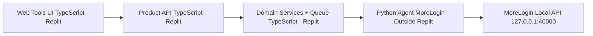

# Báo cáo nghiên cứu chuyên sâu và kế hoạch phát triển ứng dụng web tools Marketing Zalo theo hướng tận dụng lõi MoreLogin hiện có

## Tổng quan nghiên cứu thị trường và sản phẩm tham chiếu

Thị trường “phần mềm Marketing Zalo” tại Việt Nam hình thành trên nền tảng quy mô người dùng lớn và nhu cầu bán hàng/CSKH qua nhắn tin. Các số liệu công khai gần đây cho thấy entity["organization","Bộ Thông tin và Truyền thông","moi vietnam"] từng công bố (tính đến 30/6/2024) nền tảng nhắn tin entity["company","Zalo","vietnam messaging platform"] có 76,5 triệu người dùng thường xuyên hàng tháng, vượt một số nền tảng lớn khác tại Việt Nam. citeturn18view0 Tới cuối năm 2025, báo chí tiếp tục ghi nhận khoảng 79,6 triệu MAU và hơn 2,1 tỷ tin nhắn/ngày, kèm hệ sinh thái OA và Mini App của khối cơ quan/tiện ích. citeturn20view0 Các dữ kiện này giải thích vì sao nhiều doanh nghiệp và agency ưu tiên “Zalo là kênh CSKH + remarketing + chốt đơn”, từ đó kéo theo nhu cầu công cụ hóa các thao tác lặp lại.

Trong nhóm sản phẩm tham chiếu, trang **“MKT Zalo – Phần mềm quản lý bán hàng Zalo tự động”** trên entity["company","phanmemmkt.net","marketing tool vendor vietnam"] mô tả đúng kiểu “tool Zalo marketing” phổ biến: tập trung vào mở rộng tệp (kết bạn hàng loạt), tiếp cận (gửi tin hàng loạt), và khai thác nhóm (tham gia nhóm, mời nhóm, nhắn tin cho thành viên nhóm), đồng thời có lớp quản trị tài khoản và lịch sử hoạt động. citeturn2view0turn3view3 Về thông điệp bán hàng, trang nhấn mạnh các lợi ích như “làm số lượng lớn”, “tự động”, “tiết kiệm thời gian”, “chi phí thấp”, “đầu tư 1 lần dùng lâu dài”, “dễ dùng”, cùng gói hỗ trợ 1-1 và cập nhật trọn đời. citeturn2view0turn3view1

Đáng chú ý, ngay trong bài tham chiếu có liên kết sang hệ bài viết mô tả **MKT Zalo Web** (thuộc entity["company","MKT Software","marketing tool vendor vietnam"]), thể hiện một “nhánh tiến hóa” khác của tool Zalo: thay vì chỉ làm automation tác vụ, sản phẩm được định vị như một nền tảng **web** có Dashboard, quản lý đa tài khoản, hộp thư chung (unified inbox), CRM khách hàng, chiến dịch bulk messages có hẹn giờ–theo dõi tiến trình–tạm dừng/tiếp tục, quản lý link nhóm và quản lý đội nhóm/3 cấp quyền, kèm công cụ admin sao lưu/khôi phục. citeturn15view0 Điều này mở rộng đáng kể phạm vi “tính năng tương đương” nếu mục tiêu của bạn là một sản phẩm có thể dùng thực chiến cho doanh nghiệp/agency (không chỉ là tool chạy tác vụ).

Từ góc nhìn “nhóm người dùng mục tiêu”, sản phẩm tham chiếu liệt kê khá rộng: SMEs, doanh nghiệp lớn, marketer/nhà quảng cáo, cá nhân kinh doanh. citeturn2view0turn3view3 MKT Zalo Web thu hẹp hơn về bối cảnh sử dụng: agency quản lý nhiều tài khoản cho nhiều khách, e-commerce cần CSKH/bán hàng tự động, đội CSKH cần inbox tập trung, và chủ doanh nghiệp muốn giám sát hiệu suất đội nhóm. citeturn15view0 Đây là gợi ý quan trọng cho thiết kế sản phẩm của bạn: nếu muốn “tương đồng tối đa”, nên thiết kế **đa-tenant + team-based**, vừa phục vụ doanh nghiệp tự dùng, vừa có thể mở rộng sang agency.

Về mặt “chuẩn phân khúc sản phẩm” trên thị trường, nghiên cứu từ các sản phẩm tương tự cho thấy ít nhất ba nhóm giải pháp:
- **Tool automation chạy trên Zalo cá nhân** (desktop/emulator/VM): nhấn mạnh kết bạn–gửi tin–tương tác–nuôi nick–lập lịch, ví dụ ZaloPlus có gửi tin bạn bè/SĐT/nhóm, kết bạn theo gợi ý/SĐT/nhóm, tương tác like/comment và lập lịch hằng ngày. citeturn11view2
- **Nền tảng quản trị vận hành & dữ liệu** (inbox/CRM/campaign/report/team): nhấn mạnh quy trình CSKH, phân công, theo dõi chỉ số và quản trị. citeturn15view0
- **Tích hợp chính thống theo hướng OA/ZNS**: tận dụng API chính thức để gửi/nhận tin theo điều kiện, webhook nhận sự kiện, và template-based messaging (đặc biệt với ZNS). Zalo mô tả webhook sẽ gửi HTTP request đến webhook URL khi có tương tác (ví dụ người dùng nhắn OA). citeturn0search2turn8search7

Điểm mấu chốt cho kế hoạch phát triển của bạn là: ứng dụng tools sau khi hoàn thiện sẽ tích hợp qua **agent python morelogin** tại `C:\Users\Admin\Desktop\tools mkt zalo\api` để kết nối MoreLogin. Do đó định hướng kiến trúc “hợp lý nhất để triển khai thực tế” là **tách lớp môi trường & automation (agent đã có)** khỏi lớp nghiệp vụ Zalo Marketing (cần xây), và ưu tiên triển khai những phần có thể “đi đường chính thống” (OA/ZNS) cho các use-case CSKH/broadcast hợp lệ, đồng thời quản trị chặt các tính năng “có rủi ro chính sách” kiểu kết bạn/gửi tin hàng loạt qua Zalo cá nhân.

Nguyên tắc tích hợp bắt buộc cho bản thiết kế này:
- Sau khi ứng dụng tools hoàn thiện, **mọi tính năng** ở UI/API/worker phải gửi lệnh API tới agent python morelogin.
- Contract request/response phải bám theo bộ tài liệu API của agent trong `C:\Users\Admin\Desktop\tools mkt zalo\api`.
- Không module nghiệp vụ nào được gọi trực tiếp MoreLogin local API; chỉ agent python tại `C:\Users\Admin\Desktop\tools mkt zalo\api` được phép gọi lớp runtime này.

## Quyết định ngôn ngữ và môi trường triển khai (Replit)

Để phát triển thành ứng dụng web và triển khai vận hành trên Replit, quyết định kỹ thuật được chốt như sau:
- **Ngôn ngữ chính cho web tools**: `TypeScript` (áp dụng cho frontend, Product API, domain services, worker).
- **Ngôn ngữ cho lớp tích hợp MoreLogin**: `Python` (giữ nguyên agent python morelogin tại `C:\Users\Admin\Desktop\tools mkt zalo\api`).
- **Môi trường chạy web tools**: Replit (Linux cloud runtime).
- **Môi trường chạy agent**: máy/VM có MoreLogin client (thực tế thường là Windows), vì MoreLogin local API hoạt động qua localhost.

Lưu ý vận hành bắt buộc:
- Web tools trên Replit **không gọi trực tiếp** MoreLogin local API.
- Web tools trên Replit **chỉ gọi** endpoint của agent python.
- Bộ tài liệu API trong `C:\Users\Admin\Desktop\tools mkt zalo\api` là nguồn chuẩn duy nhất để mapping tính năng -> endpoint.

## Bóc tách đầy đủ bộ tính năng

Phần này tổng hợp bộ tính năng theo “chuẩn thị trường” và đối chiếu trực tiếp với nội dung mô tả của sản phẩm tham chiếu và các sản phẩm tương tự. Riêng các tính năng có thể rơi vào vùng rủi ro nền tảng (spam/automation tài khoản cá nhân) được đánh dấu rõ để bạn quyết định: **tương đồng tối đa** hay **tuân thủ tối đa**.

Bảng dưới đây mô tả “feature catalog” theo yêu cầu: mục tiêu, cách dùng, input/output, logic xử lý dự kiến và mức ưu tiên triển khai.

Lưu ý kiến trúc: toàn bộ logic trong bảng đều được thực thi theo mô hình **Tools -> Product API -> Agent API (`C:\Users\Admin\Desktop\tools mkt zalo\api`) -> MoreLogin**.

| Nhóm | Tính năng | Mục tiêu | Cách dùng (tóm tắt) | Dữ liệu đầu vào | Dữ liệu đầu ra | Logic xử lý dự kiến bên trong | Ưu tiên |
|---|---|---|---|---|---|---|---|
| Quản lý tài khoản | Quản lý đa tài khoản + trạng thái + danh mục | Vận hành hàng chục–hàng trăm tài khoản trên 1 giao diện | Thêm tài khoản → xem trạng thái → phân nhóm/danh mục → gán cho nhân viên | Account metadata; trạng thái session/token; mapping team | Danh sách tài khoản, trạng thái hoạt động, cảnh báo lỗi | Thiết kế entity `ZaloAccount`; tách “metadata” khỏi “credential”; cron health-check → phát sự kiện status-change; ghi lịch sử thao tác | P0 |
| Quản lý phiên/môi trường | Gán proxy riêng theo tài khoản | Giảm rủi ro lỗi mạng, quản lý “chất lượng tài khoản” theo kênh/proxy | Nhập proxy → test → gán cho account/profile → theo dõi fail-rate | Proxy inventory; rule gán; account↔proxy | Proxy health, assignment history | `ProxyHealthChecker` + policy (sticky/rotating); auto-quarantine proxy lỗi; log nguyên nhân fail | P0 |
| Quản lý phiên/môi trường | Quản lý browser profile theo tài khoản (MoreLogin) | Mỗi tài khoản có môi trường riêng; hỗ trợ chạy song song | Tạo profile → gán proxy → mở session → chạy job → đóng session | OS/browser params; proxy; tag/group | env_id, session endpoint, trạng thái | Product API gọi **Python Agent Connector** (trỏ tới `C:\Users\Admin\Desktop\tools mkt zalo\api`) để tạo/mở/đóng profile; mapping account↔env_id; idempotency cho create/open; theo dõi upstream lỗi | P0 |
| Tự động hóa thao tác | Job/Queue nền + throttle theo tài khoản | Chạy bulk actions ổn định, có retry/dừng khi rủi ro | Tạo chiến dịch → chia job → worker xử lý → báo tiến trình | Job definitions; concurrency limits; rate policy | Job status, progress, DLQ | Queue-based: per-account limiter + circuit breaker; DLQ; retry exponential backoff; correlation id | P0 |
| Marketing/CSKH | Inbox tập trung (unified inbox) đa tài khoản | CSKH xử lý hội thoại tập trung, không bỏ sót | Đồng bộ hội thoại → lọc/ghim → trả lời → gán tag/ghi chú | Message events; customer mapping; assignment rules | Conversation threads; trạng thái gửi/đọc | Ingestion pipeline chuẩn hóa event → Conversation/Message; realtime update; lock theo conversation để tránh double-reply | P0 |
| Marketing/CSKH | CRM khách hàng + tag + ghi chú + phân công phụ trách | Lưu trữ và phân loại khách hàng, remarketing đúng nhóm | Khi chat/import → tạo/cập nhật khách → tag → phân công → xem timeline | UID/phone; tags; notes; owner | Segments, timeline, export datasets | Identity resolution chống trùng; tính chỉ số tương tác; field-level permission theo role/team | P0 |
| Gửi tin/chiến dịch | Bulk Messages có hẹn giờ, progress realtime, pause/resume | Triển khai chiến dịch có kiểm soát và đo lường | Tạo campaign → chọn tệp → soạn nội dung → set lịch/tốc độ → chạy | Audience; template; schedule; throttle | Delivery report, per-recipient status | `CampaignEngine` tạo queue per-recipient; idempotency per-recipient; retry; progress aggregator; lưu lịch sử chiến dịch | P0 |
| Import/Export | Import Excel/CSV (SĐT/khách hàng/danh sách) | Tạo tệp nhanh, chuẩn hóa dữ liệu | Upload → mapping cột → validate/preview → import | File CSV/XLSX; mapping rules | Import result; error file | ETL parse→validate→normalize→dedup→upsert; lưu lineage; PII encryption/masking | P0 |
| Báo cáo | Dashboard tổng quan (tài khoản–tin nhắn–top khách–nhật ký) | Quản trị hiệu quả marketing/CSKH | Chọn phạm vi thời gian/team → xem biểu đồ, top lists | Aggregated events | Charts/tables | Event logging → aggregation (OLAP/rollup); cache; incremental compute | P1 |
| Quản trị | Phân quyền 3 cấp + theo dõi hoạt động nhân viên | Kiểm soát nội bộ, phù hợp agency/team | Tạo user → gán role → gán account/campaign → audit | User/role/policy | Permission decisions; audit trail | RBAC + ABAC (theo account/campaign); audit domain events | P0 |
| Quản trị | Sao lưu/khôi phục + giám sát hệ thống | Giảm downtime, đảm bảo an toàn dữ liệu | Cấu hình backup schedule/retention → restore theo snapshot | Backup config | Backup artifacts; restore logs | Automated backups; encryption; DR drill; audit thao tác admin | P1 |
| Kết nối ngoài | Tích hợp OA/ZNS (webhook + gửi tin theo điều kiện) | Đi “đường chính thống” cho CSKH/notification | Lưu token/secret → đăng ký webhook URL → nhận event → gửi tin theo loại | OA credentials; webhook events; templates | Inbound events; outbound status | Agent API: token mgmt + webhook handler + sender; dedup event; retry; idempotency message | P0 |
| Nhóm (group) | Quản lý link nhóm + theo dõi thành viên & vai trò + lịch hành động | Khai thác nhóm để mở rộng tệp và tương tác | Lưu link nhóm → sync danh sách thành viên → lập lịch kết bạn/gửi tin | Group link; member list; schedule rules | Group registry; scheduled actions | Group service + scheduler + chống trùng giữa nhiều account; (phụ thuộc khả năng data-access hợp lệ) | P1 |
| Kết bạn (rủi ro) | Kết bạn hàng loạt theo SĐT/gợi ý/thành viên nhóm + thu hồi lời mời | Mở rộng tệp nhanh như nhiều tool mô tả | Import SĐT/chọn nhóm → chạy theo tốc độ → xem lịch sử → thu hồi | Phone list; group member list | Friend request statuses; lead list | Action engine + chống trùng + pause khi rủi ro; lưu lịch sử; kiểm soát rate | P2 (khuyến nghị giới hạn) |
| Nuôi tài khoản (rủi ro) | “Nuôi nick”/tương tác giả lập & kịch bản | Tạo hoạt động đều nhằm “tăng trust” theo mô tả thị trường | Chọn kịch bản → chạy theo lịch → theo dõi log | Scenario; schedules | Execution logs; account health | Workflow runner + randomization trong ngưỡng; auto-stop nếu fail-rate tăng | P3 (khuyến nghị tránh) |

Nguồn bóc tách chính cho các tính năng “cốt lõi” của sản phẩm tham chiếu gồm: kết bạn hàng loạt theo SĐT/thành viên nhóm/gợi ý và thu hồi lời mời; gửi tin hàng loạt theo tệp SĐT/bạn bè/thành viên nhóm; kéo mem nhóm (tham gia nhóm, mời nhóm, nhắn tin nhóm); quản lý tài khoản không giới hạn; quản lý lịch sử kết bạn/nhắn tin/nhóm. citeturn2view0turn3view3 Với nhánh “nền tảng web có hệ thống”, MKT Zalo Web bổ sung các mảng Dashboard, inbox tập trung, CRM, bulk messages có hẹn giờ–progress–pause/resume, import Excel/CSV, quản lý đội nhóm và admin backup/restore. citeturn15view0

Để bảo đảm “tương đồng tối đa” với thị trường, đối chiếu thêm cho thấy:
- ZaloPlus có nhóm tính năng gửi tin (bạn bè/SĐT/nhóm/thành viên nhóm), kết bạn (gợi ý/SĐT/nhóm), tương tác like/comment và lập lịch chạy hằng ngày. citeturn11view2  
- Top Zalo Support mô tả đăng nhập nhiều tài khoản, gửi tin theo bạn bè/SĐT/nhóm/thành viên nhóm, gửi theo tag, và import data Excel cho tác vụ kết bạn. citeturn11view1  
- akaBiz nêu rõ cơ chế “chia dữ liệu tránh trùng lặp khi nhiều tài khoản cùng trong một nhóm”, bắt trạng thái gửi/đã nhận/đã xem, và hành vi gửi lại cho nhóm “đã gửi thành công” bằng cách lưu tên Zalo để tìm lại. citeturn13view0  
- Ninja System Zalo nhấn mạnh nuôi nick, đăng bài profile tự động, gửi tin hàng loạt, tạo nhóm chat/kéo mem và trả lời tự động. citeturn14view3turn14view1  

Các mô tả này là bằng chứng để bạn chuẩn hóa backlog theo “chuẩn ngành”: **đa tài khoản → dữ liệu/CRM → chiến dịch/bulk → automation/scheduler → giám sát & phân quyền**.

## Phân tích kiến trúc hệ thống dự kiến

Đặt vai trò là kiến trúc sư hệ thống cấp cao, mục tiêu kiến trúc không phải “chạy được vài tác vụ”, mà là xây một nền tảng **ổn định, có thể scale, có audit, có phân quyền, có dữ liệu**, và quan trọng nhất: **tách rời lớp nghiệp vụ Zalo Marketing khỏi lớp môi trường/automation** để bạn tận dụng tối đa lõi hiện có, đồng thời kiểm soát rủi ro nền tảng.

### Kiến trúc tổng thể đề xuất

Kiến trúc cấp cao nên gồm bốn lớp theo chuỗi gọi chuẩn:

1) **Product Layer (Web Tools UI - TypeScript - Replit)**  
Giao diện vận hành cho admin/manager/staff: quản lý tài khoản, inbox, CRM, campaign, báo cáo, cấu hình, audit.

2) **Core Backend (Product API + Domain Services - TypeScript - Replit)**  
Các dịch vụ nghiệp vụ: IAM (user/team/RBAC), Account/Session, CRM/Data, Campaign/Scheduler. Đây là “bộ não” của web tools và là nơi định nghĩa Product API.

3) **Python Agent MoreLogin (thư mục `C:\Users\Admin\Desktop\tools mkt zalo\api`, chạy ngoài Replit)**  
Lớp tích hợp chuẩn hóa để thao tác môi trường/automation, gồm các nhóm chức năng:
- **System**: health, status, ready, metrics, audit logs, automation jobs.
- **Profiles**: create, update, delete, list, open, close.
- **Proxy**: add, list, delete.
- **Automation**: start, stop.
Vai trò của lớp này: chuẩn hóa auth, rate limit, idempotency/correlation, audit và gom toàn bộ gọi lên MoreLogin về một đầu mối.

4) **MoreLogin Runtime Layer (Local API + Agent/Runners)**  
MoreLogin local API chạy tại `http://127.0.0.1:40000` và chỉ khả dụng trên localhost. citeturn10view0 Vì vậy agent/runner phải chạy gần node cài MoreLogin để thực thi open/close profile, proxy/session orchestration và automation runtime.

Luồng end-to-end chuẩn cần được cố định: **`Web Tools (Replit) → Product API (TypeScript) → Python Agent API (C:\Users\Admin\Desktop\tools mkt zalo\api) → MoreLogin`**.

Điểm quản trị then chốt: **mọi tác vụ quan trọng phải phát sinh event log và audit log**, để bất kỳ hành vi nào “có thể làm hỏng tài khoản/vi phạm chính sách” đều có ngưỡng dừng tự động.

### Kiến trúc backend và API

Với bối cảnh bạn định tích hợp trực tiếp qua **agent python morelogin** tại `C:\Users\Admin\Desktop\tools mkt zalo\api`, backend nên tách rõ bốn lớp theo phụ thuộc:
- **Product Layer**: web app tools (TypeScript, chạy trên Replit).
- **Core Backend**: domain services + orchestration + policy (TypeScript, chạy trên Replit).
- **Python Agent MoreLogin**: lớp trung gian tích hợp kỹ thuật.
- **MoreLogin**: local API/runtime.

Phân vai API:
- **Agent Integration Layer (trong `C:\Users\Admin\Desktop\tools mkt zalo\api`)**: cung cấp contract ổn định cho system/profiles/proxy/automation và các luồng OA/ZNS; contract này lấy từ bộ tài liệu API trong cùng thư mục và che chắn việc gọi MoreLogin local API.
- **Product API (cần xây)**: IAM, Account/Session, Inbox/CRM, Campaign, Reports, System Config; mọi tính năng chỉ gọi endpoint của agent python, không gọi MoreLogin trực tiếp.

Quy ước ngôn ngữ và nơi chạy:

| Thành phần | Ngôn ngữ | Nơi chạy |
|---|---|---|
| Web UI + Product API + Domain/Worker | TypeScript | Replit |
| Agent MoreLogin | Python | Node máy/VM có MoreLogin |
| MoreLogin runtime | Runtime của MoreLogin | Localhost trên node agent |

Mapping nhóm chức năng của agent python vào use-case:

| Nhóm chức năng trong agent python (`C:\Users\Admin\Desktop\tools mkt zalo\api`) | Trạng thái | Use-case cho tools marketing |
|---|---|---|
| `system/*` (`health`, `status`, `ready`, `metrics`, `audit/logs`, `automation/jobs`) | Đã có | Healthcheck, giám sát, truy vết, theo dõi lịch sử job |
| `profiles/*` | Đã có | Tạo/mở/đóng/cập nhật profile theo tài khoản marketing |
| `proxy/*` | Đã có | Quản lý kho proxy và gán proxy phục vụ multi-account |
| `automation/*` | Đã có | Start/stop automation theo env/profile |

Hai mặt API này cần được “kết dính” bằng một nguyên tắc: **idempotency + rate limit + request correlation**. Ví dụ về mặt kiến trúc, khi Campaign Engine tạo 10.000 delivery attempts, hệ thống phải:
- tạo job theo batch (VD: 500 recipients/batch),
- mỗi “delivery attempt” có idempotency key dạng `(campaign_id, recipient_id, step)` để retry không gửi trùng,
- lưu trạng thái theo finite-state-machine: `queued → sending → delivered/read/failed`,
- có circuit breaker dừng chiến dịch/đóng account khi tỷ lệ fail tăng.

### Tổ chức dữ liệu

Để đáp ứng đầy đủ feature set (unified inbox + CRM + campaign + audit), nên thiết kế tối thiểu các thực thể:

- **Tenant/Workspace**: doanh nghiệp/agency.  
- **User/Role/Policy**: RBAC + phạm vi theo team/tài khoản.  
- **ZaloAccount**: metadata, trạng thái, owner, mapping tới môi trường.  
- **BrowserProfile**: env_id, proxy_id, tags, group.  
- **Proxy**: kho proxy + health.  
- **Customer/Lead**: identity (UID/phone), tags, assignment, consent flags.  
- **Conversation/Message**: thread + message events (inbound/outbound, status).  
- **Campaign**: cấu hình chiến dịch, audience, template, schedule, throttle.  
- **DeliveryAttempt**: per-recipient trạng thái gửi/nhận/đọc/thất bại.  
- **Job/Task**: queue item, worker run, retries.  
- **AuditLog**: ai làm gì, lúc nào, tác động gì, kết quả gì.

Lưu ý: Các sản phẩm trong thị trường thường khoe “bắt trạng thái gửi: đã nhận/chưa, đã xem chưa” (akaBiz) citeturn13view0 và “theo dõi trạng thái tin nhắn: đã gửi/đã nhận/đã đọc/thất bại” (MKT Zalo Web). citeturn15view0 Để làm được điều này ở cấp kiến trúc, bạn phải xem “trạng thái tin nhắn” như một **state machine** chứ không phải chỉ là log text.

### Kiến trúc job/queue và khả năng scale

Ba rủi ro lớn nhất của phần mềm loại này là: (1) gửi trùng, (2) nghẽn hàng đợi, (3) hỏng hàng loạt tài khoản vì không có “auto-stop”. Vì vậy kiến trúc job nên có:
- Queue tách theo loại tác vụ: `sync_inbox`, `send_campaign`, `import_data`, `compute_reports`, `automation_run`.
- Throttle theo “tài khoản” và theo “proxy”.
- Dead-letter queue để cách ly batch lỗi.
- Observability bắt buộc: metrics + trace + structured logs.

Đồng thời, do MoreLogin local API chỉ có trên localhost, agent/runner là bắt buộc nếu muốn scale nhiều node. citeturn10view0

### Tích hợp MoreLogin

Điểm thay đổi kiến trúc bắt buộc: **tools marketing không gọi MoreLogin trực tiếp**. Thay vào đó:
- Tools gọi **Product API**.
- Product API/Core Backend gọi **Python Agent MoreLogin** tại `C:\Users\Admin\Desktop\tools mkt zalo\api`.
- Agent python là lớp gọi MoreLogin local API (`http://127.0.0.1:40000`) và trả kết quả ngược lại.

Về mặt kỹ thuật, MoreLogin cung cấp API tạo profile nhanh `POST /api/env/create/quick` và cho phép batch create tối đa 50 profiles. citeturn10view0turn10view1 Đây là nền tảng tốt để agent python xây “profile factory” (tạo hàng loạt môi trường theo quy tắc) và gán vào pool tài khoản.

Trong kiến trúc mới, MoreLogin local API được xem là **backend runtime của agent python** (không phải interface public cho tools). Cách tách này giúp:
- giảm coupling giữa nghiệp vụ marketing và lớp anti-detect runtime,
- tập trung auth/rate-limit/audit tại Product API + agent python,
- thuận lợi cho migration/cutover khi thay đổi engine automation sau này.

Tuy nhiên, bản thân MoreLogin cũng được mô tả như anti-detect browser phục vụ multi-account, nên tích hợp này phải được quản trị rủi ro chặt. citeturn10view5

### Cơ chế log, retry, giám sát lỗi

Thị trường đã tự thừa nhận rủi ro: Top Zalo Support nêu rõ tool không phải sản phẩm chính thức và “lạm dụng spam… có thể dẫn đến khóa tài khoản”. citeturn11view1 Do đó kiến trúc bắt buộc cần:
- audit log cấp domain,
- cảnh báo theo ngưỡng (block-rate, fail-rate),
- cơ chế pause campaign tự động,
- cơ chế “quarantine” proxy/tài khoản.

## Sơ đồ module phần mềm

Bảng module dưới đây tối ưu theo tiêu chí: **độc lập nhưng liên kết chặt**, đúng yêu cầu “module hóa” để phát triển và vận hành.

Quy ước triển khai: toàn bộ module nghiệp vụ web tools trong bảng này được phát triển bằng TypeScript và chạy trên Replit; riêng agent python chạy ngoài Replit.

| Module | Chức năng | Input / Output | Quan hệ với module khác | Độ khó |
|---|---|---|---|---|
| IAM & Tenant | User/team/role, RBAC/ABAC, audit domain | In: invite/login/policy. Out: token/decision/audit | Bắt buộc cho mọi API & UI | Trung bình |
| Account & Session | Quản lý tài khoản, trạng thái, mapping môi trường | In: QR/OAuth/token, proxy rules. Out: session state | Dùng Python Agent Connector; cấp account pool cho Campaign | Khó |
| Python Agent Connector (`C:\Users\Admin\Desktop\tools mkt zalo\api`) | Tích hợp `system/profiles/proxy/automation`; chuẩn hóa gọi lớp agent trung gian | In: env params, proxy, automation command. Out: env_id, session/job status | Campaign/Automation gọi qua connector; connector gọi agent python; không gọi MoreLogin trực tiếp | Trung bình–Khó |
| Zalo Integration (OA/ZNS qua Agent API) | Gửi/nhận tin chính thống, webhook, template thông qua endpoint agent | In: token/secret, payload. Out: events/status | Cấp dữ liệu cho Inbox/CRM; được Product API gọi qua Python Agent Connector | Trung bình |
| Unified Inbox | Hộp thư chung, phân công, tag/notes, SLA | In: message events. Out: conversation views/replies | Phụ thuộc CRM + Zalo Integration (qua Agent API) + IAM | Trung bình |
| CRM & Data | Customer, tag, segmentation, dedup, timeline | In: imports + message events. Out: segments/exports | Dùng bởi Inbox, Campaign, Reports | Trung bình |
| Campaign & Scheduler | Bulk messages, scheduling, progress, pause/resume | In: audience, template, rules. Out: delivery reports | Phụ thuộc Job/Queue; gọi Python Agent Connector để agent điều phối OA/ZNS/automation | Khó |
| Job/Queue & Observability | Queue, retry, DLQ, metrics, alerting, backup | In: jobs/events. Out: status/logs/alerts | Xuyên suốt toàn hệ thống | Khó |

Một điểm cố ý trong sơ đồ: **Campaign** không trực tiếp “gửi tin”; Campaign chỉ *ra quyết định và tạo job*, còn việc gửi tin/thao tác tài khoản thuộc về các endpoint agent API. Cách tách này giúp bạn thay đổi chiến lược (OA/ZNS vs automation) mà không làm vỡ core business logic.

## Đối chiếu với hệ thống hiện có

Dựa trên định hướng mới, hệ thống ứng dụng tools sau khi hoàn thiện sẽ tích hợp qua **agent python morelogin** tại `C:\Users\Admin\Desktop\tools mkt zalo\api` để quản lý profile/proxy/session/automation và kết nối MoreLogin local API. Điều này tương ứng với phần lõi “hạ tầng môi trường” mà các tool Zalo trên thị trường thường phải tự xây.

Mức độ sẵn sàng mong muốn của agent python:

| Nhóm chức năng Agent Python (`C:\Users\Admin\Desktop\tools mkt zalo\api`) | Mức sẵn sàng | Ý nghĩa trong kiến trúc mới |
|---|---|---|
| `system` | Đã có | Vận hành/giám sát và audit lớp trung gian |
| `profiles` | Đã có | Quản lý vòng đời profile cho account pool |
| `proxy` | Đã có | Quản lý kho proxy và gán proxy |
| `automation` | Đã có | Điều khiển start/stop automation |

Phần còn thiếu chính để hoàn thiện kiến trúc mới là: **lớp Product API cho tools marketing** (IAM, Account/Session, Inbox/CRM, Campaign, Reports, Config).

Bảng đối chiếu dưới đây thể hiện rõ phần “đã có” và “còn thiếu” so với chuẩn tính năng suy ra từ sản phẩm tham chiếu và nhóm sản phẩm tương tự:

| Tính năng cần có | Bằng chứng tham chiếu/thị trường | Thành phần bạn đang có | Mức đáp ứng | Cần bổ sung | Hướng triển khai |
|---|---|---|---|---|---|
| Quản lý đa tài khoản + trạng thái + gán proxy | MKT Zalo Web: quét QR, theo dõi trạng thái, cấu hình proxy theo tài khoản. citeturn15view0 | Agent python có thể đảm nhiệm nhóm `profiles` + `proxy` | Một phần | Thiếu `ZaloAccount`, QR/OAuth flow, trạng thái theo Zalo | Xây Account Service + Session Service; mapping ZaloAccount↔env_id; bổ sung health-check tài khoản |
| Inbox tập trung + quản lý tin nhắn | MKT Zalo Web: hộp thư chung, lọc/ghim, trạng thái gửi/đọc, đính kèm. citeturn15view0 | Agent python có hạ tầng automation + quan sát job (`system/automation/jobs`) | Chưa có | Thiếu Product API cho inbox + mapping endpoint agent cho Conversation/Message model | Ưu tiên OA/ZNS qua endpoint Agent API; UI inbox realtime |
| CRM khách hàng + tag + phân công | MKT Zalo Web: CRM, tag, thao tác hàng loạt. citeturn15view0 | Chưa có CRM entities | Chưa có | Thiếu Customer/Tag/Timeline + phân quyền theo dữ liệu | Xây CRM module; message event → upsert customer; bulk tagging/assignment |
| Bulk campaign (hẹn giờ/progress/pause/import Excel) | MKT Zalo Web: bulk messages + hẹn giờ + progress + import Excel/CSV. citeturn15view0 | Agent python có `automation/start|stop` + `system/automation/jobs` + rate-limit nền tảng | Một phần | Thiếu Product API cho Campaign Engine + Scheduler + DeliveryAttempt | Xây Campaign Service + Worker; idempotency per recipient; progress realtime (SSE/WebSocket) |
| Group link/nhóm (theo dõi thành viên/vai trò/lịch hành động) | MKT Zalo Web: quản lý link nhóm, theo dõi role, lên lịch. citeturn15view0 | Agent python có hạ tầng automation | Một phần | Thiếu Product API cho Group registry và mapping endpoint agent để sync member hợp lệ | Thiết kế Group Service; ưu tiên hành động hợp lệ; phần không có API đưa vào nhóm high-risk |
| Phân quyền nội bộ + nhật ký hoạt động | MKT Zalo Web có 3 cấp quyền và lưu nhật ký người dùng. citeturn15view0 | Agent python có auth + `system/audit/logs` mức môi trường | Một phần | Thiếu Product API cho user/team management | Xây IAM module đa tenant; audit domain events (không chỉ API calls) |
| Giám sát hệ thống/backup/restore/alerting | MKT Zalo Web có admin backup/restore & giám sát. citeturn15view0 | Agent python có `system/metrics|status|ready|health|audit/logs` mức môi trường | Một phần | Thiếu alerting + backup DB business + per-account health trong Product API | Observability stack + backup pipeline; auto-pause khi fail-rate cao |

Kết luận đối chiếu: lõi tích hợp mục tiêu của bạn mạnh nhất ở **agent python morelogin** trong `C:\Users\Admin\Desktop\tools mkt zalo\api` cho môi trường & automation (`system/profiles/proxy/automation`) và các luồng OA/ZNS. Phần còn thiếu gần như nằm ở “lớp nghiệp vụ sản phẩm” và **Product API cho tools marketing**: IAM đa tenant, dữ liệu hội thoại, CRM, campaign, workflow, UI/UX, cùng mapping đầy đủ mọi tính năng vào endpoint của agent.

### Kế hoạch migration kiến trúc (direct MoreLogin -> qua agent python)

1) **Đóng băng tích hợp trực tiếp**  
Không cho tools marketing gọi MoreLogin trực tiếp; mọi thay đổi mới đi qua Product API và được route sang agent python.

2) **Xây Product API + Python Agent Connector**  
Product API nhận yêu cầu nghiệp vụ và gọi agent python tại `C:\Users\Admin\Desktop\tools mkt zalo\api` thông qua một connector thống nhất (kèm auth, idempotency key, correlation id).

2.1) **Chuẩn hóa contract theo tài liệu API agent**  
Lập bảng mapping endpoint cho từng tính năng (account/inbox/CRM/campaign/report/admin); mọi request/response phải bám bộ tài liệu API trong `C:\Users\Admin\Desktop\tools mkt zalo\api`.

3) **Cutover theo cụm chức năng**  
Chuyển lần lượt theo thứ tự: `profiles/proxy` -> `automation` -> `system observability`; đo lỗi và latency theo từng cụm trước khi mở rộng.

4) **Vận hành song song có rollback**  
Trong giai đoạn chuyển đổi, giữ cơ chế feature flag để rollback nhanh về luồng cũ nếu phát sinh lỗi nghiêm trọng; khi ổn định thì loại bỏ hoàn toàn đường gọi trực tiếp.

## Lộ trình phát triển phần mềm

Roadmap dưới đây ưu tiên “triển khai thực tế” và “tận dụng lõi sẵn có”, đồng thời kiểm soát rủi ro chính sách bằng cách **compliant-first** (OA/ZNS) cho các use-case CSKH/notification hợp lệ; các phần “automation tài khoản cá nhân” nếu vẫn muốn tương đồng tối đa sẽ nằm ở phase sau và phải có cơ chế giới hạn.

| Giai đoạn | Mục tiêu | Hạng mục công việc | Kết quả đầu ra | Phụ thuộc kỹ thuật | Rủi ro cần lưu ý |
|---|---|---|---|---|---|
| Thiết lập nền Replit & chuẩn ngôn ngữ | Chốt web stack TypeScript và baseline môi trường Replit | Chuẩn hóa cấu trúc repo, script run/build/start, env schema, healthcheck endpoint | Replit-ready skeleton (web UI + API + worker) | Replit runtime + Node.js LTS | Cấu hình sai khiến app không chạy ổn định trên Replit |
| Khảo sát & đặc tả | Chốt phạm vi, phân loại tính năng theo mức rủi ro | PRD + backlog P0–P3; acceptance criteria; risk register | PRD v1 + feature catalog chuẩn hóa | Có đủ dữ liệu vận hành nội bộ | Scope creep; yêu cầu “spam-like” đẩy rủi ro pháp lý |
| Thiết kế kiến trúc & dữ liệu | Chốt kiến trúc module, ERD, job/queue, agent model | Architecture doc; ERD; API specs; PoC OA webhook qua agent API | Tài liệu thiết kế + PoC | MoreLogin local API là localhost nên cần agent/runner citeturn10view0 | Thiết kế sai dẫn đến rewrite; hạn chế API nền tảng |
| Xây lõi nền tảng | Có core chạy được: IAM + data + queue + observability + tích hợp agent python hiện có | Implement IAM; core services; queue; metrics/logs; admin console tối thiểu | MVP core platform + CI/CD | DB/cache/queue; vault | Sai thiết kế queue; rò PII |
| Tính năng P0 tương đương tham chiếu | Đạt “dùng được” như MKT Zalo Web core: account + inbox + CRM + bulk | Account/session; inbox; CRM tags; import; bulk campaign; audit | Pilot nội bộ 1–2 team | Endpoint OA/ZNS/runner được gọi qua Agent API theo use-case | Quota/giới hạn gửi; chất lượng dữ liệu; UX phức tạp |
| Nâng cao & tối ưu | Bổ sung P1–P2: group link, auto-reply, dashboard nâng cao, workflow | Workflow builder; report; alerting; backup/restore | v1.0 đầy đủ module | Dữ liệu thực tế; scale workers | Độ phức tạp tăng; chi phí infra |
| Chuẩn hóa vận hành | Harden security/compliance, quy trình support | Pen-test; retention policy; on-call/runbook; monitoring SLA | Release candidate + handbook | Tuân thủ dữ liệu cá nhân; chính sách nền tảng | Rủi ro pháp lý/ToS, lộ dữ liệu, downtime |

## Đề xuất công nghệ

Do bạn sẽ xây dựng web tools trên Replit và tích hợp với agent python morelogin, phương án phù hợp nhất là:
- **Ngôn ngữ web tools**: TypeScript (chung cho frontend + backend + worker).
- **Ngôn ngữ agent**: Python (giữ nguyên agent tại `C:\Users\Admin\Desktop\tools mkt zalo\api`).

Nguồn chuẩn để phát triển integration là bộ tài liệu API trong `C:\Users\Admin\Desktop\tools mkt zalo\api`; mọi module nghiệp vụ cần bám tài liệu này khi thiết kế endpoint mapping.

Đề xuất stack tham khảo theo mô hình “Replit web app (TypeScript) + Python agent”:

- **Frontend web**: Next.js + TypeScript.
- **Backend/Product API**: Next.js Route Handlers hoặc Fastify/NestJS (TypeScript), chuẩn hóa schema bằng Zod/OpenAPI.
- **Worker/Queue**: BullMQ + Redis (managed Redis) để có retry/DLQ/throttle.
- **Database**: PostgreSQL managed (Neon/Supabase) cho dữ liệu nghiệp vụ.
- **Cache**: Redis cho session state, rate counters, progress realtime.
- **Object Storage**: S3-compatible để lưu import/export, backup artifacts.
- **Observability**: structured logs + metrics + trace + alerting.
- **CI/CD**: build/test/lint + validate contract agent API trước khi deploy.
- **Runtime phân tách**: web tools chạy trên Replit; agent python chạy trên node có MoreLogin vì local API chỉ khả dụng localhost. citeturn10view0

### Hướng dẫn triển khai phù hợp trên Replit

1. **Khởi tạo dự án Replit với TypeScript**: tạo web app (frontend + API) và chuẩn script `dev`, `build`, `start`, `worker`.
2. **Đồng bộ tài liệu API agent vào repo**: sao chép bộ docs từ `C:\Users\Admin\Desktop\tools mkt zalo\api` vào thư mục docs nội bộ của dự án để review/version hóa.
3. **Sinh lớp Agent Client trong TypeScript**: ánh xạ toàn bộ endpoint cần dùng, thêm timeout/retry/idempotency key/correlation id.
4. **Khai báo biến môi trường trên Replit**: `AGENT_BASE_URL`, `AGENT_API_KEY`, `DATABASE_URL`, `REDIS_URL`, `APP_BASE_URL`.
5. **Kết nối Replit -> Agent an toàn**: dùng HTTPS + token ký + allowlist IP hoặc tunnel an toàn; không mở endpoint agent công khai không kiểm soát.
6. **Triển khai webhook OA/ZNS**: webhook nhận tại web tools trên Replit, sau đó route vào domain service và gọi agent API khi cần thao tác môi trường.
7. **Thiết lập healthcheck và auto-restart**: có endpoint `/health`, cảnh báo khi mất kết nối agent hoặc queue bị nghẽn.
8. **Vận hành production**: tách workload API và worker (nếu cần), giám sát latency từ Replit tới agent để tối ưu retry/backoff.

Về tích hợp nền tảng chính thống, nếu đi theo OA/ZNS:
- Thiết kế endpoint tương ứng trong agent python để xử lý webhook events (Zalo gửi request HTTP về webhook URL khi có tương tác). citeturn0search2turn8search7  
- Thiết kế sender cho OA Open API/ZNS nằm trong lớp agent; Zalo PHP SDK (repo chính thức) cho thấy có cơ chế OAuth cho OA admin cấp quyền và gửi tin “tư vấn” bằng endpoint OA send message. citeturn21view0  
- Với ZNS (notification), agent chỉ gửi theo template đã đăng ký; các module nghiệp vụ gọi đúng endpoint theo tài liệu API của agent. citeturn0search18turn8search2  

Các chi tiết trên ảnh hưởng trực tiếp tới kiến trúc dữ liệu (template registry, consent flags, webhook ingestion) và KPI (delivery/read).

## Phân tích rủi ro và khuyến nghị

Rủi ro của phần mềm Marketing Zalo không chỉ là “kỹ thuật”, mà là tổng hòa của **rủi ro nền tảng + pháp lý + bảo mật + vận hành**. Đây là phần bắt buộc phải đưa vào “risk register” ngay từ giai đoạn PRD.

**Rủi ro nền tảng và chính sách (cao):**  
Thị trường thừa nhận khả năng bị khóa tài khoản nếu lạm dụng gửi tin hàng loạt/spam. Top Zalo Support nêu rõ công cụ không phải sản phẩm chính thức và cảnh báo việc lạm dụng spam có thể dẫn đến khóa tài khoản. citeturn11view1 Vì sản phẩm tham chiếu tập trung vào kết bạn hàng loạt, gửi tin hàng loạt, kéo mem nhóm… citeturn2view0turn3view3 nên nếu bạn phát triển theo hướng “tương đồng tối đa” cho Zalo cá nhân, rủi ro nền tảng sẽ ở mức rất cao và khó kiểm soát bằng kỹ thuật thuần túy.

**Khuyến nghị:** tách rõ hai “chế độ sản phẩm” ngay từ kiến trúc và roadmap:  
- **Chế độ compliant-first (ưu tiên P0/P1)**: inbox/CRM/campaign dựa trên OA/ZNS + webhook. Zalo mô tả rõ cơ chế webhook cho OA. citeturn0search2turn8search7  
- **Chế độ high-risk (P2/P3, có giới hạn)**: các tác vụ kết bạn hàng loạt/nuôi nick… chỉ nên đưa vào nếu có cơ sở pháp lý và kiểm soát abuse (giới hạn tốc độ, tệp khách hàng có consent, auto-stop theo ngưỡng, audit đầy đủ).

**Rủi ro pháp lý & dữ liệu cá nhân (tăng mạnh từ 2026):**  
Bài viết trên entity["organization","VnExpress","vietnam news site"] liên hệ việc cập nhật điều khoản của Zalo với Luật Bảo vệ dữ liệu cá nhân có hiệu lực từ 1/1/2026, nhấn mạnh nguyên tắc về sự đồng ý theo mục đích và các chế tài xử phạt. citeturn17view0 Vì phần mềm của bạn sẽ xử lý dữ liệu nhạy cảm (SĐT, lịch sử hội thoại, hành vi tương tác), rủi ro pháp lý/tuân thủ là trọng yếu.

**Khuyến nghị:**  
- Thiết kế **consent management** ngay trong CRM (cờ consent, nguồn consent, thời điểm).  
- Masking dữ liệu theo vai trò; audit truy cập dữ liệu; retention policy (tự xóa sau N ngày).  
- Hạn chế lưu “credential thô”; dùng vault/encryption; phân tách quyền truy cập.

**Rủi ro kỹ thuật (trung bình–cao):**  
- Nghẽn queue và gửi trùng (thiếu idempotency per-recipient).  
- Lỗi upstream từ lớp agent python/môi trường (đặc biệt khi phụ thuộc client local). MoreLogin local API chỉ chạy trên localhost, nên nếu orchestration giữa agent python (`C:\Users\Admin\Desktop\tools mkt zalo\api`) và runner sai, bạn sẽ gặp lỗi kết nối/điều phối. citeturn10view0  
- Rủi ro mạng Replit -> agent (timeout, đứt tunnel, sai cấu hình TLS/token) có thể làm gián đoạn toàn bộ tính năng web tools.  
- Realtime inbox: nếu không có ingestion chuẩn và cơ chế dedup event, sẽ “double message/double ticket”.

**Khuyến nghị:**  
- Campaign engine phải có idempotency per-recipient và state machine rõ ràng.  
- Thiết kế agent/runner chuẩn: heartbeats, capacity reporting, retry, circuit breaker.  
- Thiết kế lớp Agent Client TypeScript có timeout/retry/backoff và fallback queue khi agent tạm thời không sẵn sàng.
- Observability bắt buộc: metrics/log/trace; auto-pause khi vượt fail-rate.

**Rủi ro bảo mật (cao):**  
- Tài khoản Zalo/OA token, session artifacts, PII khách hàng là mục tiêu tấn công.  
- Nếu có module “nhiều tài khoản trên một máy” thì bề mặt tấn công tăng.

**Khuyến nghị:**  
- Zero-trust nội bộ: mọi thao tác nhạy cảm phải có audit.  
- Secrets vault; rotate keys; principle of least privilege.  
- Mã hóa at-rest; ký URL tải file export; giới hạn IP admin.

**Rủi ro cạnh tranh & sản phẩm (trung bình):**  
Thị trường có nhiều tool mô tả tính năng tương tự (kết bạn/gửi tin/lập lịch/nuôi nick). citeturn11view2turn14view3turn12view0 Lợi thế cạnh tranh bền vững thường không nằm ở “spam được nhiều hơn”, mà nằm ở: **quy trình vận hành chuẩn, dữ liệu sạch, phân quyền rõ, báo cáo minh bạch, và tích hợp hệ thống ngoài** (CRM/BI/ERP).

**Khuyến nghị:**  
- Lấy “inbox + CRM + campaign + audit + team workflow” làm lõi cạnh tranh (như MKT Zalo Web mô tả). citeturn15view0  
- Xây “governance” cho feature high-risk: toggle theo tenant, quota chặt, log bắt buộc, review nội dung, whitelist tệp khách hàng có consent.

Tóm lại, nếu mục tiêu là “tương đồng tối đa” với sản phẩm tham chiếu **và** vẫn “triển khai thực tế bền vững”, chiến lược hợp lý nhất là: phát triển web tools bằng **TypeScript trên Replit**, và để **mọi tính năng** gửi lệnh API tới agent python morelogin theo bộ tài liệu tại `C:\Users\Admin\Desktop\tools mkt zalo\api`; agent sẽ là lớp tích hợp duy nhất để kết nối MoreLogin và điều phối các luồng OA/ZNS, còn lớp sản phẩm tập trung vào vận hành + dữ liệu (inbox/CRM/campaign/report/team).
