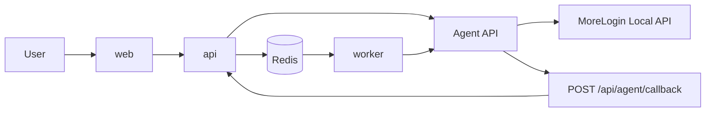

# 02-TARGET-ARCHITECTURE-REPLIT-AGENT

> Owner role: Tech Lead  
> Status: [SOURCE OF TRUTH] Approved v1.1  
> Last updated: 2026-03-30  
> Related docs: 11-REPLIT-BLUEPRINT.md, 06-AGENT-API-CONTRACT-MAPPING.md, 08-REPLIT-DEPLOYMENT-AND-ENV-SETUP.md

## 1) Kien truc dich da khoa

Kien truc bat buoc:

`Web Tools TypeScript (Replit) -> Product API (Replit) -> Agent Python API -> MoreLogin Local API`

## 2) Runtime boundaries

| Lop | Runtime | Ghi chu |
|---|---|---|
| web | Replit service `web` | UI cho nguoi dung |
| api | Replit service `api` | Product API + callback endpoint |
| worker | Replit service `worker` | queue consumer + async polling |
| agent | Node/VM ngoai Replit | Python Agent API |
| morelogin local api | localhost tren node agent | khong expose truc tiep |

## 3) Luong tong the

## 4) Quy tac tich hop bat buoc

- Moi module nghiep vu phai goi Agent thong qua `packages/agent-client`.
- Cam goi HTTP truc tiep den Agent tu module business.
- Cam goi MoreLogin Local API tu Web Tools.
- HMAC canonical va callback verification phai dung bo golden vectors.

## 5) NFR chinh

| Nhom | Muc tieu |
|---|---|
| Availability | healthcheck per service + dependency check |
| Reliability | retry theo loai loi + idempotency key |
| Security | HMAC signing, secret rotation, callback verify |
| Observability | structured logs, metrics, correlation_id |
| Recoverability | rollback theo version/tag |

## 6) Mo hinh trien khai chot

Mau trien khai duy nhat la `1 workspace + 3 services`, duoc khoa trong `11-REPLIT-BLUEPRINT.md`.
Khong su dung mo hinh tach roi workspace cho tung service trong phien ban nay.

## 7) Acceptance architecture

- [ ] Tech Lead va DevOps doc doc lap va ve cung 1 so do runtime.
- [ ] Khong con cau hoi mo ve callback endpoint, startup order, rollback order.
- [ ] 100% feature co mapping sang endpoint agent trong `06-...`.
