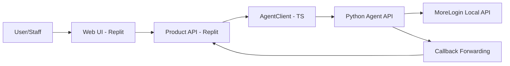

# 02-TARGET-ARCHITECTURE-REPLIT-AGENT

## 1) Kiến trúc đích

Kiến trúc bắt buộc của hệ thống:

`Web Tools (Replit, TypeScript) -> Product API (Replit) -> Agent API (Python) -> MoreLogin Local API`

### 1.1 Ranh giới runtime

| Lớp | Công nghệ | Runtime |
|---|---|---|
| Web UI + Product API + Worker | TypeScript | Replit |
| Agent Integration | Python | Node/VM có MoreLogin |
| MoreLogin API | Local service | `127.0.0.1:40000` trên node agent |

## 2) Sơ đồ luồng tổng thể

## 3) Luồng nghiệp vụ chính

### 3.1 Luồng đồng bộ profile

1. User thao tác trên UI.
2. Product API tạo `request_id`, `idempotency_key`, ký HMAC qua AgentClient.
3. Gọi `POST /agent/v1/commands/profile.*` (sync).
4. Trả kết quả về UI, ghi audit log.

### 3.2 Luồng bất đồng bộ job

1. Product API gọi command always-async (`browser.open_and_run`, `schedule.create`, `file.*`).
2. Nhận `job_id`.
3. Worker poll `GET /agent/v1/jobs/{job_id}` hoặc nhận callback.
4. Cập nhật state machine và tiến trình cho UI.

### 3.3 Luồng callback

1. Agent ingest callback từ MoreLogin.
2. Agent forward callback về endpoint backend.
3. Backend verify signature callback.
4. Upsert event idempotent và cập nhật trạng thái domain.

## 4) Contract tích hợp bắt buộc

- Auth headers: `X-API-Key`, `X-Timestamp`, `X-Nonce`, `X-Signature`.
- Canonical string: `{METHOD}\n{PATH}\n{TIMESTAMP}\n{NONCE}\n{SHA256(BODY)}`.
- Replay controls:
- Timestamp window: 120s.
- Nonce TTL: 300s.
- Rate limit: 60 req/min/key.

## 5) NFR bắt buộc

| Nhóm | Yêu cầu |
|---|---|
| Availability | Có healthcheck cho web tools và agent |
| Reliability | Retry với backoff + jitter theo loại lỗi |
| Consistency | Mọi luồng quan trọng có idempotency key |
| Observability | Structured logs + metrics + trace + alert |
| Security | Secret management + key rotation + RBAC + audit |

## 6) Chiến lược kết nối Replit -> Agent

- Kết nối qua HTTPS endpoint của agent (public URL bảo vệ bằng token/HMAC).
- Không public MoreLogin local API.
- Thiết kế timeout + retry + circuit breaker trong AgentClient.

## 7) Rủi ro kiến trúc và biện pháp

| Rủi ro | Tác động | Biện pháp |
|---|---|---|
| Mất kết nối Replit -> Agent | Gián đoạn toàn bộ tính năng | Retry/backoff, queue tạm, alerting |
| Lỗi HMAC ký sai | Toàn bộ request 401 | Shared auth library + contract tests |
| Queue backlog lớn | Delay campaign/inbox | Scale worker + DLQ + rate policy |
| Event callback trùng | Sai trạng thái nghiệp vụ | Event idempotency + dedup table |

## 8) Checklist xác nhận kiến trúc trước khi code

- [ ] Tách runtime Replit và runtime agent rõ ràng.
- [ ] Không có bất kỳ call trực tiếp MoreLogin local API trong web tools.
- [ ] Có tài liệu endpoint mapping cho 100% feature.
- [ ] Có test strategy cho sync, async, callback, retry.
