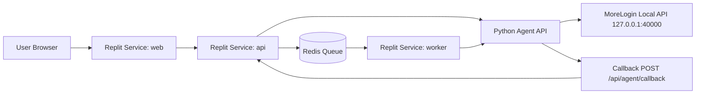

# 11-REPLIT-BLUEPRINT

> Owner role: Tech Lead + DevOps/Replit Engineer  
> Status: [SOURCE OF TRUTH] Approved v1.0  
> Last updated: 2026-03-30  
> Related docs: 02-TARGET-ARCHITECTURE-REPLIT-AGENT.md, 08-REPLIT-DEPLOYMENT-AND-ENV-SETUP.md, 10-CUTOVER-ROLLBACK-OPERATIONS.md, appendices/.replit.example

## 1) Quyet dinh trien khai da khoa cung

- Mo hinh cuoi cung: **1 workspace + 3 deployment services**.
- 3 services bat buoc:
  - `web` (UI frontend)
  - `api` (Product API + callback ingress)
  - `worker` (queue consumer + polling jobs)
- Agent Python MoreLogin chay ngoai Replit.
- Web Tools **khong** goi truc tiep MoreLogin local API.

## 2) Topology runtime

## 3) Port mapping va endpoint

| Service | Port noi bo | Public route | Mo ta |
|---|---:|---|---|
| `web` | `3000` | `/` | UI cho staff |
| `api` | `4000` | `/api/*` + `/health*` | API nghiep vu + callback endpoint |
| `worker` | none | none | Process nen xu ly queue/polling |

Endpoint callback chuan: `POST /api/agent/callback` (thuoc `api` service).

## 4) Dependency matrix

| From | To | Giao tiep | Bat buoc |
|---|---|---|---|
| web | api | HTTPS noi bo/route gateway | Yes |
| api | redis | TCP | Yes |
| worker | redis | TCP | Yes |
| api | agent | HTTPS + HMAC | Yes |
| worker | agent | HTTPS + HMAC | Yes |
| agent | api callback | HTTPS + callback signature | Yes |

## 5) Startup order

1. Provision secrets va runtime (`.replit.example`, `replit.nix.example`, `.env.example.md`).
2. Start `redis` va database managed service.
3. Deploy service `api`, verify `GET /health` + `GET /health/dependencies`.
4. Deploy service `worker`, verify worker heartbeat + queue consume test.
5. Deploy service `web`, verify login + core navigation.
6. Chay smoke suite: auth vector + command sync + command async + callback.

## 6) Healthcheck matrix

| Component | Check | Tan suat | Dieu kien pass |
|---|---|---|---|
| web | `GET /health` (via web gateway) | 30s | 200 + build/version |
| api | `GET /health`, `GET /health/dependencies` | 30s | db/redis/agent reachable |
| worker | worker heartbeat metric | 30s | heartbeat age < 60s |
| agent | `GET /agent/v1/health` | 60s | `success=true` |
| upstream morelogin | `GET /agent/v1/health/upstream` | 60s | upstream status ok |

## 7) Scaling va restart policy

- `web`: scale theo concurrent sessions.
- `api`: scale theo RPS + callback ingest latency.
- `worker`: scale theo queue backlog + async job SLA.
- Restart bat ky service nao cung phai giu idempotency key va queue durability.

## 8) Rollback impact matrix

| Rollback service | Tac dong | Cach giam rui ro |
|---|---|---|
| web | anh huong UI, api van tiep tuc | canary front-end + cache bust |
| api | dung endpoint nghiep vu + callback | chuyen traffic ve tag truoc, tam khoa campaign |
| worker | delay async jobs | tang retry window, giu queue backlog |
| full stack | downtime ngan han | go-live gate + backup/restore test |

## 9) Callback flow chuan

1. Agent gui callback den `POST /api/agent/callback`.
2. API verify signature theo `callback-signature-golden-vectors.md`.
3. API dedupe theo `event_id`.
4. API ghi audit log + cap nhat state machine.
5. Neu fail, dua vao dead-letter va cho phep retry control.

## 10) Bang quyet dinh da chot (khong tu y thay doi)

| Quyết định | Trang thai |
|---|---|
| Replit model = 1 workspace + 3 services | Locked |
| Callback route = `/api/agent/callback` | Locked |
| Mọi call Agent di qua `packages/agent-client` | Locked |
| HMAC canonical format dung chung | Locked |
| Fixture payload that dat tai `api/examples/fixtures/*` | Locked |

## 11) Bien ban bang chung “ky su thu 2 dung duoc ngay”

Checklist evidence bat buoc:
- [ ] Ky su thu 2 tao environment moi chi tu template.
- [ ] Dien secrets theo `appendices/replit-secrets-matrix.md`.
- [ ] Start thanh cong `web`, `api`, `worker`.
- [ ] Smoke pass cho health, sync command, async command, callback verify.
- [ ] Luu evidence: `request_id`, `job_id`, log snippet, screenshot dashboard.
- [ ] Khong co cau hoi mo ve kien truc trien khai.
